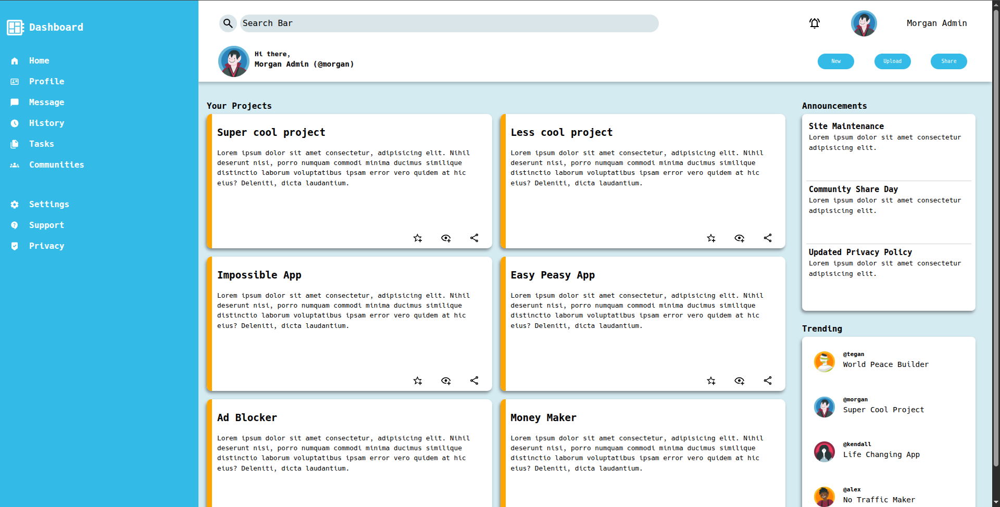
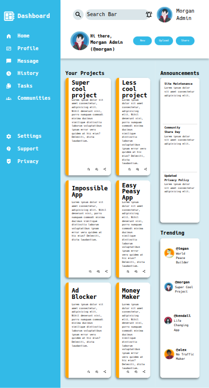

# 📊 Admin Dashboard Project - The Odin Project Intermediate HTML & CSS
## 🚀 Project Overview

This Admin Dashboard is a project from the Intermediate HTML and CSS module in The Odin Project
's curriculum. It focuses on transforming a given design layout into a fully functional, responsive dashboard interface using HTML and CSS Grid. The goal of the project was to replicate a professional-looking dashboard layout without the use of any CSS frameworks or JavaScript.

It challenged the developer to think in terms of CSS layout systems, and to focus on visual structure, responsiveness, and design fidelity.

## ✨ Features

- Modern Dashboard Layout: Built using only semantic HTML and CSS Grid, replicating a professional admin dashboard layout.

- **Responsive Design**: Mobile-first and adaptable design for various screen sizes.

- **Navigation Sidebar:** Fully styled left-hand sidebar with navigation links and icons.

- **Top Navigation Bar:** Includes search input, user profile image, and notification icon.

- **Main Content Area:** Grid-based display of project cards, announcements, and trending sections.

- **Consistent UI Styling**: Unified styling system for colors, typography, spacing, and layout.

- **Icon Integration:** Clean and scalable SVG or icon fonts included for interface elements.

## 🛠️ Technologies Used

**HTML5:** Semantic structuring of content and layout.

**CSS3 (Grid + Flexbox):** CSS Grid used for overall layout structure; Flexbox used for component alignment within sections.

**Google Icons**: Integrated icons to match the design mockup.

**Responsive Design Techniques:** Ensured layout adjusts gracefully across various screen widths.

## 💡 What I Learned & Reinforced

This project was a key part of mastering layout design and CSS architecture. Key takeaways include:

- **CSS Grid Mastery:** Learned how to construct complex, multi-column, and multi-row layouts using grid-template-areas and grid auto-flow.

- **Component Styling:** Gained experience in modular and reusable CSS for UI sections like cards, navbars, and sidebars.

- **Responsive Design Principles:** Applied media queries and mobile-first strategies to ensure cross-device compatibility.

- **Design Interpretation:** Improved ability to accurately translate a static design/mockup into working code.

- **Spacing & Alignment:** Avoid layout breaks or overlapping content.

## ⚙️ How to Run

Try it [LIVE](https://bgns42.github.io/admin-dashboard/)!

Or run locally:

1. **Clone the repository:**
```
git clone https://github.com/BGNS42/admin-dashboard.git
```

2. **Navigate to the project directory:**
```
cd admin-dashboard
```

4. **Open** `index.html`:

- Launch the file in your preferred web browser to view the dashboard.

## 📸 Screenshots





## 🚧 Challenges & Solutions
### 🧱 Structuring the Core Layout with CSS Grid and Nested Content

**Challenge:** The dashboard required multiple layers — sidebar, header, main content, and nested grids. Adding or modifying sections often disrupted the layout or broke responsiveness.

**Solution:** I used grid-template-areas to clearly define the page structure and added sub-grids within key sections. auto-fit, auto-fill, and minmax() allowed the layout to adjust fluidly to different screen widths.

### 📋 Maintaining Clarity in a Single CSS File

**Challenge:** Keeping all styles in a single file made it harder to stay organized, especially when tracking down specific selectors or debugging unexpected style interactions. Without a clear structure, styles could easily become tangled or overwritten.

**Solution:** I organized the CSS file in a top-down, sectioned approach — starting with header styles, followed by nested header components, then sidebar styles and their inner elements, and so on. Each block was clearly separated with comments, and I followed consistent naming conventions throughout. This structure made the file easy to navigate and helped prevent unwanted cascading effects or style conflicts.

### 📱 Making the Layout Minimally Responsive

**Challenge:** The original design didn’t include responsive behavior, but I still wanted the dashboard to display reasonably well on different screen sizes. I wasn't aiming for pixel-perfect accuracy, but I did want to avoid layout breaks or overlapping content.

**Solution:** I used relative units like %, fr, and em along with auto-fit and minmax() in CSS Grid to make elements adapt to available space. I also applied media queries where necessary to adjust layout or spacing on smaller screens. The result isn’t fully responsive for all devices, but it's flexible enough to maintain usability and readability on most common screen widths.

### 🌀 Ensuring UI Consistency Across Components

**Challenge:** Maintaining consistent styles (typography, color palette, icon sizes, spacing) across various sections and cards was tricky.

**Solution:** I created CSS variables for core values like spacing units, colors, and font sizes. Base styles were defined for tags like h1, button, p, and icons were normalized for size and alignment using utility classes or inline styles.

## 🖼️ Asset Credits
- **Avatar icons** used in this project were <a href="http://www.freepik.com">Designed by Freepik</a>


## 🧑‍💻 Author

Made by [BGNS42](https://github.com/BGNS42)

💼 [LinkedIn](https://www.linkedin.com/in/igor-carrasco/)

## 📄 License

This project is open-source and available under the [MIT License](LICENSE).